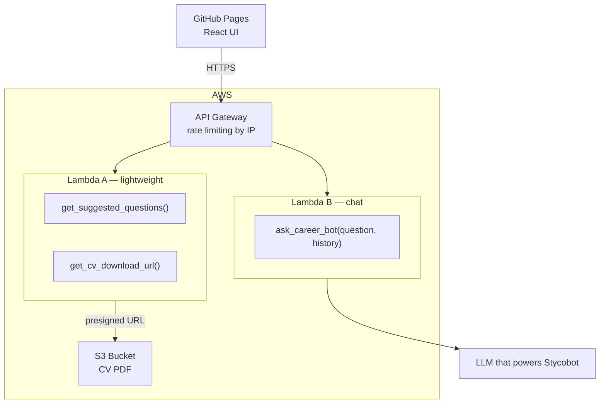

# Career Chatbot — System Design
 
## Overview
 
Two AWS Lambda functions behind API Gateway, served from an existing GitHub Pages frontend.

## Components
 
### GitHub Pages
- Hosts the React UI statically
- Stores conversation history in browser memory per session
- Passes full history with every request to Lambda B
 
### API Gateway
- Single entry point for all Lambda calls
- Handles IP-based rate limiting
- Provides HTTPS endpoint for the UI
 
### Lambda A — lightweight
Handles all non-chat tools. No OpenAI dependency, fast cold start.
 
| Tool | Description |
|---|---|
| `get_suggested_questions()` | Returns hardcoded prompt chips shown on UI load |
| `get_cv_download_url()` | Generates a short-lived presigned S3 URL for CV download |
 
### Lambda B — chat
Handles all AI interactions. Loads career docs at startup as system prompt context.
 
| Tool | Input | Output |
|---|---|---|
| `ask_career_bot()` | `question: str`, `history: list` | `reply: str` |
 
### S3 Bucket
- Stores CV PDF in a private bucket
- Lambda A generates presigned URLs on demand — file is never publicly exposed
 
### LLM API
- Model: TBD
- Called only by Lambda B
- Career docs injected as system prompt on every request
 
---
 
## Session model
 
Conversation history lives in the browser. On each message the UI sends the full history to Lambda B, which prepends the career docs system prompt and calls OpenAI. Lambda remains stateless.
 
---